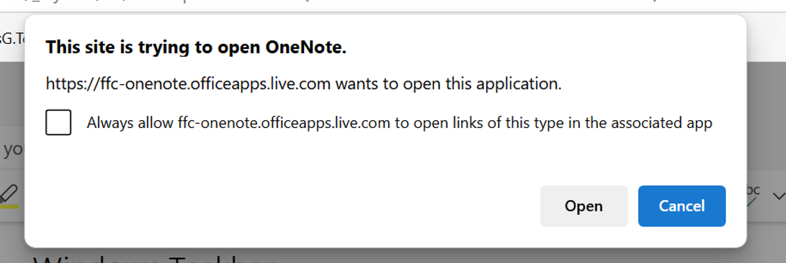

# Uri Launching Safety - Local Only Uri Schemes

This project demonstrates how applications (WebBrowsers) that launch Uris from untrusted sources 
can mitigate the danger created by enabling Uris to be identified as "local only" for launching.

This is based on a naming system where `local+` is use as a prefix to identify them as
local only. It also allows the schemes registration to specify this.

## The Security Threat

Web pages and other untrusted programs can launch Uris that are not safe to launch. For example, a web page
can invoke `ms-setting:` or `shell:` which can launch applications that are not intended to be run from 
the web.

Uri scheme creators have to consider this threat when they design their scheme and its handling.
Untrusted invokes are possible. In some cases, this eliminates the possibility of using uri launching in designs.

### Current Mitigation - Display a confirmation prompt.

This threat is currently mitigated by this dialog presented in Microsoft Edge.
.

#### Potential Improvements

Web Browsers should display the name, publisher and other information that identifies the program that is going
to be launched to help users make decisions about what is a legitimate launch case.
Windows APIs provide access to this information when launching with `ShellExecuteExW()` using 
`IHandlerActivationHost`/`IHandlerInfo` on the service provider object. This sample demonstrates how to do this.

### New Mitigation - Detecting Local only Uris

In this mitigation, the local only Uris are detected and the browsers never try to launch them.

#### `local+` Prefix match

Schemes with the prefix are considered local only. Here is the template for the registry configuration
for such a scheme.
```
HKCR\local+<scheme suffix>
    "URL Protocol"
```

#### Registry Configuration

For existing schemes that don't have a `local+` prefix that want this behavior, they opt in via registration
using the `LocalOnly` registry value.

```
HKCR\<scheme>
    "URL Protocol"
    LocalOnly
```

#### Minimum URL Zone

An alternative proposal allows a minimum URLZONE to be specified. When `URLZONE_LOCAL_MACHINE`
is used, this has the same effect `LocalOnly`.

This approach also enables the handler of the launch, via its ProgId, to declare its local 
only status without needing to use a specific prefix or provide registration on the scheme itself.

```
HKCR\<scheme progId>
    MinimumAllowedUrlZone = 0
    \shell\open\command 
        UriInvokeHandler.exe %1
```

```cpp
enum URLZONE { 
  URLZONE_LOCAL_MACHINE	= 0,
  URLZONE_INTRANET = 1,
  URLZONE_TRUSTED	= 2,
  URLZONE_INTERNET = 3,
  URLZONE_UNTRUSTED = 4,
}
```

### Design Questions

- Is it useful to allow schemes to specify a minimum zone too? 
That would enable Web Pages on the Intranet to launch some schemes.
- What about `EditFlags` `FTA_SafeForElevation`, what role should it have?
- Should specific handlers register their safety rather than the uri scheme itself? 
- That is, for the same scheme, handled by different apps could one be local only where the other is not?
- Is a a hard coded list of known local only schemes (like the public suffix) useful?
- Should this system provide a user override, so a user could opt-out a scheme (making it less safe?)

## TODOs for the os.
- Update all of the OS provided schemes that don't specify EditFlags FTA_SafeForElevation to add LocalOnly.

