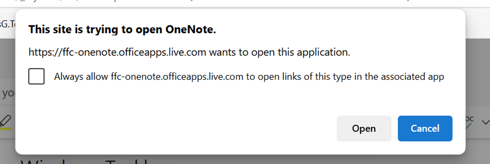

# Uri Launching Safety - Local Only Uri Schemes

This project demonstrates how applications (WebBrowsers) that launch Uris from untrusted sources 
can mitigate the danger created by enabling Uris to be identified as "local only" for launching.

This is based on a naming system where `local+` is use as a prefix to identify them as
local only. It also allows the schemes registration to specify this.

## The Security Threat

Web pages and other untrusted programs can launch Uris that are not safe to launch. For example, a web page
can invoke `ms-setting:` or `shell:` which can launch applications that are not intended to be run from 
the web.

Uri scheme creators have to consider this threat when they design their scheme and its handling.
Untrusted invokes are possible. In some cases, this eliminates the possibility of using uri launching in designs.

### Current Mitigation - Display a confirmation prompt.

This threat is currently mitigated by this dialog presented in Microsoft Edge.
.

#### Potential Improvements

Web Browsers should display the name, publisher and other information that identifies the program that is going
to be launched to help users make decisions about what is a legitimate launch case.
Windows APIs provide access to this information when launching with `ShellExecuteExW()` using 
`IHandlerActivationHost`/`IHandlerInfo` on the service provider object. This sample demonstrates how to do this.

### New Mitigation - Detecting Local only Uris

In this mitigation, the local only Uris are detected and the browsers never try to launch them.

#### `local+` Prefix match

Schemes with the prefix are considered local only. Here is the template for the registry configuration
for such a scheme.
```
HKCR\local+<scheme suffix>
    "URL Protocol"
```

#### Registry Configuration

For existing schemes that don't have a `local+` prefix that want this behavior, they opt in via registration
using the `LocalOnly` registry value.

```
HKCR\<scheme>
    "URL Protocol"
    LocalOnly = REG_NONE
```

The presence of the `LocalOnly` value is the signal; it carries no payload. It is registered as a
`REG_NONE` value. The association query API (`IQueryAssociations::GetData` with `ASSOCDATA_VALUE`)
detects the value regardless of its type, so `REG_DWORD` also works, but `REG_NONE` is preferred:
it is a presence-only marker and avoids the ambiguity of a `REG_DWORD = 0`, which reads like "off"
while still being present.

#### Minimum URL Zone

An alternative proposal allows a minimum URLZONE to be specified. When `URLZONE_LOCAL_MACHINE`
is used, this has the same effect `LocalOnly`.

This approach also enables the handler of the launch, via its ProgId, to declare its local 
only status without needing to use a specific prefix or provide registration on the scheme itself.

```
HKCR\<scheme progId>
    MinimumAllowedUrlZone = 0
    \shell\open\command 
        UriInvokeHandler.exe %1
```

```cpp
enum URLZONE { 
  URLZONE_LOCAL_MACHINE	= 0,
  URLZONE_INTRANET = 1,
  URLZONE_TRUSTED	= 2,
  URLZONE_INTERNET = 3,
  URLZONE_UNTRUSTED = 4,
}
```

## Packaged Uri Scheme Handlers

The mitigations above are expressed as classic registry registration (`HKCR`). Packaged
apps (MSIX / appx) don't write `HKCR` directly; they declare a Uri scheme with the
`windows.protocol` manifest extension and deployment synthesizes the registration:

```xml
<uap:Extension Category="windows.protocol">
  <uap:Protocol Name="myscheme">
    <uap:DisplayName>My Scheme</uap:DisplayName>
    <uap:Logo>Assets\Logo.png</uap:Logo>
  </uap:Protocol>
</uap:Extension>
```

The problem: the `windows.protocol` schema is closed. Its only children are `DisplayName`,
`Logo`, `MigrationProgIds`, and `ProgId`. There is no `Properties` bag and no security,
zone, or safety attribute, so a packaged handler has no in-place field to mark a scheme as
local only.

This splits detection by source:

- **Unpackaged** handlers: the registry is the source of truth (`local+` prefix or the
  `LocalOnly` value, read via `IQueryAssociations`).
- **Packaged** handlers: the detector instead enumerates an **AppExtension** contract
  (below). The `local+` prefix still works for packaged handlers and needs no lookup.

### `local+` Prefix match (works today)

A packaged handler can name its scheme with the `local+` prefix
(`<uap:Protocol Name="local+myscheme" />`). Prefix detection is registration-agnostic, so
it works identically for packaged and unpackaged handlers with no schema change and no
duplicated data. This is the recommended baseline for new schemes. The limitation is the
same as for unpackaged schemes: it only applies to new scheme *names* and can't retrofit an
existing one.

### Detecting a packaged local only scheme (AppExtension)

Packaged handlers declare a `windows.appExtension` whose contract `Name` is owned by the
shell:

```
com.microsoft.windows.urischeme.localonly
```

This name follows the AppExtension reverse-DNS convention (`com.microsoft.browser.ext`,
`com.microsoft.edge.extension`): `com.microsoft.windows` is the owning host (the OS/shell
detector), `urischeme` matches the `local+` prefix / "uri scheme" vocabulary used here, and
`localonly` echoes the `LocalOnly` registry value — so the same term spans the prefix, the
registry marker, and the packaged contract.

The scheme name is carried in `<uap3:Properties>`, not in `Id`. `Id` is limited to 39
characters of alphanumerics/period/dash, which excludes the `+` that uri schemes allow (e.g.
`local+foo`); `Properties` is opaque, host-read, and unconstrained.

For multiple schemes, use a single **delimited `<Schemes>`** element (or one AppExtension
instance per scheme, each with a distinct `Id`). Do **not** use repeated `<Scheme>` siblings:
the Properties XML is surfaced to the host as an `IPropertySet` (a string-keyed map), so two
elements with the same tag collide on one key. This was verified empirically — repeated
`<Scheme>` siblings collapsed and read back **empty**, while the delimited `<Schemes>` element
read back intact:

```xml
<uap3:Extension Category="windows.appExtension">
  <uap3:AppExtension Name="com.microsoft.windows.urischeme.localonly"
                     Id="sample" DisplayName="My local only schemes">
    <uap3:Properties>
      <Schemes>local+alpha;local+beta</Schemes>   <!-- one or more, ';'-delimited -->
    </uap3:Properties>
  </uap3:AppExtension>
</uap3:Extension>
```

> Note: the contract `Name` `com.microsoft.windows.urischeme.localonly` is 41 characters. The
> AppExtension `Name` only allows >39 characters when the package targets build 18307 or
> later, so the provider must declare `TargetDeviceFamily MinVersion="10.0.19041.0"` (or any
> build ≥ 18307). Older targets cap `Name` at 39 and will fail manifest validation.

The detector resolves "is this a local only uri scheme" for a packaged handler by opening the
catalog for the contract, then matching the queried scheme against each instance's
`Schemes` property:

```cpp
// Windows.ApplicationModel.AppExtensions
auto catalog = AppExtensionCatalog::Open(L"com.microsoft.windows.urischeme.localonly");
// for each AppExtension: read Properties["Schemes"], split on ';', compare to the queried scheme
```

This works today with no OS schema change and retrofits existing scheme names — the consumer
(detector) needs no package identity of its own; `AppExtensionCatalog` is a system catalog
readable from any process (e.g. an unpackaged browser / `ShellExecute` caller). Its cost is
that the scheme is restated alongside the `<uap:Protocol>` declaration, so the two can drift
(a coherency hazard). The protocol attribute below removes that duplication once the OS
supports it.

### Proposed: `LocalOnly` attribute on `<uap:Protocol>` (OS change)

For existing scheme names that can't take the prefix, add a `LocalOnly` (and/or a
`MinimumUrlZone`) attribute to the `windows.protocol` element, and have appx deployment
translate it into the same association marker the unpackaged path already reads
(`IQueryAssociations::GetData` with `ASSOCDATA_VALUE` / `LocalOnly`). This keeps a single
source of truth on the protocol declaration and lets the browser/ShellExecute detector use
one uniform check for both packaged and unpackaged handlers.

```xml
<uap:Protocol Name="myscheme" LocalOnly="true" />
<!-- or -->
<uap:Protocol Name="myscheme" MinimumUrlZone="0" />   <!-- 0 = URLZONE_LOCAL_MACHINE -->
```

### Approaches considered and rejected

Alternatives rejected: `uap:EditFlags` (file-type-association only, no `FTA_SafeForElevation`) and overloading the user-visible `DisplayName`.

### Gap: `windows.protocol` can't specify a COM handler (`DelegateExecute` / CLSID)

A related closed-schema gap: classic registration lets a scheme route its invoke to a
COM handler instead of spawning a command line, via `DelegateExecute` on the open
command (an `IExecuteCommand` handler; `DropTarget` is the analogous case):

```
HKCR\<scheme>\shell\open\command
    DelegateExecute = {CLSID}
```

This works for both out-of-process and in-process handlers (out-of-process is the common,
most useful case), and enables async/return-results invokes, multi-target launches, and
reusing an already-running process. Packaged *file* handlers already have a manifest
equivalent — a verb references a registered CLSID by `Clsid`:

```xml
<desktop4:Extension Category="windows.fileExplorerContextMenus">
  <desktop4:FileExplorerContextMenus>
    <desktop5:ItemType Type="Directory">
      <desktop5:Verb Id="Command1" Clsid="00000000-0000-0000-0000-000000000000" />
    </desktop5:ItemType>
  </desktop4:FileExplorerContextMenus>
</desktop4:Extension>
```

`windows.protocol` has no such `Clsid` attribute, so a packaged protocol handler can only get
command-line / app activation, never a `DelegateExecute`-style COM handler. The proposed fix
mirrors `desktop5:Verb`: add a `Clsid` attribute to `<uap:Protocol>` that references the
handler's CLSID, so the protocol invoke dispatches to an `IExecuteCommand` handler.

```xml
<uap:Protocol Name="myscheme" Clsid="00000000-0000-0000-0000-000000000000" />
```

### Design Questions

- Is it useful to allow schemes to specify a minimum zone too? 
That would enable Web Pages on the Intranet to launch some schemes.
- What about `EditFlags` `FTA_SafeForElevation`, what role should it have?
- Should specific handlers register their safety rather than the uri scheme itself? 
- That is, for the same scheme, handled by different apps could one be local only where the other is not?
- Is a a hard coded list of known local only schemes (like the public suffix) useful?
- Should this system provide a user override, so a user could opt-out a scheme (making it less safe?)

## TODOs for the os.
- Update all of the OS provided schemes that don't specify EditFlags FTA_SafeForElevation to add LocalOnly.

